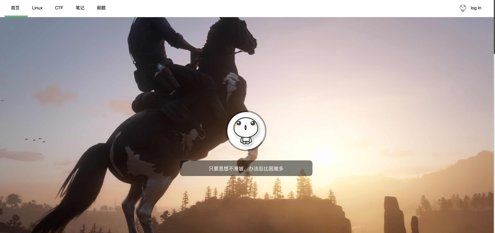
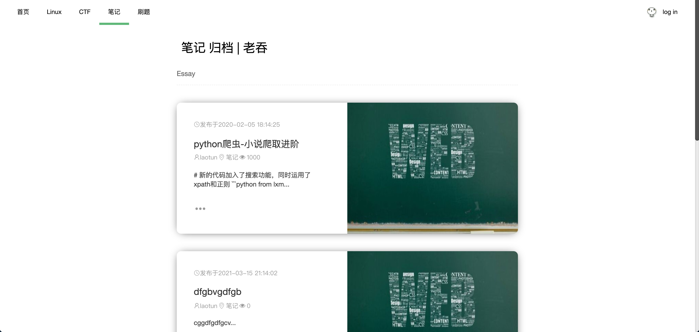
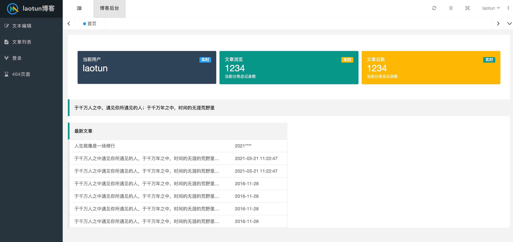

# my_blog
- 个人博客系统，前后端分离

# 主要技术
### 前端
- layui
- layuimini后台模板
- jQuery

### 后端
- Spring
- SpringMVC
- Mybatis

# 主要功能：
- 文章，页面，分类目录，删除，编辑等。文章及页面支持Markdown，支持代码高亮。
- 支持文章全文搜索。

# 预览
### 主页

### 分类显示

### 后台

